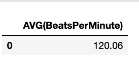

#Using SQL to Investigate Spotify’s Top Songs:
 
 
This is an SQL investigation of the top songs on Spotify in August of 2019.
 
 
 
Now we have the table TopSongs in our SQL database, to see what it looks like use the code below:

 
 

#ArtistName
 
 
First we will look at the Artists that have songs in the TopSongs table:

 
 

We can see that Ed Sheeran is the only artist who has 4 songs in the top 50 songs on Spotify at the time this dataset was created. 9 other artists have 2 songs in the top 50 Spotify songs and the rest of the artists only have 1 song in the top 50 Spotify songs.
 
If you went through the data table a bit you may have noticed that some songs included the name of a featured artist within the TrackName, the code below will show how many songs in the top 50 Spotify songs have a featured artist on the track.
 
 

 
 

 
 
13 of the top Spotify songs have featured artists, that is 26% which is quite a lot. Perhaps having a featured artist on a track helps a song end up on the Spotify Top 50 songs.
 
 
#Genre
Next we will look at genre, the code below shows the genres that appear in the Spotify Top 50 songs.

 
 

 
 
The top genre is dance pop, followed by pop and then latin. Looking at all the genres we see that there are multiple genres that include the word ‘pop’. The below code shows the number of songs that include the word ‘pop’ in their genre.
 
 

 
 

 
 
23 songs include the word ‘pop’. That means almost half the songs that are in the Spotify Top 50 songs are either a pop song or a variation of pop. Clearly pop songs do well on Spotify and may be a factor in being apart of the top 50 Spotify songs.
 
 
Another word that is seen in multiple genres is the word ‘rap’. The code below shows the number of songs that include the word ‘rap’ in their genre.
 
 

 
 

 
 

 
 
There are 5 songs that are either a rap song or a variation of rap. This is 10 percent of the entire data set. Although it is not as high as the number of pop songs, rap songs also do well on Spotify.
 
 
Another word that appeared in multiple genres was ‘hip hop’. The code below shows the number of songs that include ‘hip hop’ in their genre.

 
 

 
 
There were just four songs with ‘hip hop’ in the genre but this is still 8%. Another word that was included in four songs genre’s was ‘reggaeton’.
 
 

 
 

 
 
#Beats Per Minute
Beats per minute may be an influencer to getting a song to be in Spotify’s top 50 songs. The below code will output the average beats per minute of the top 50 Spotify songs.
 
 

 
 

 
The average beats per minute is 120.06. The code below will show if a song is above the average, below the average, or the average beats per minute. Keep in mind, these songs are ordered by top spot. So the first song will be the number one top song on Spotify at the time this data set was created.
 

 

 
 
Half of the top ten songs are above the average beats per minute and the other half are below the average beats per minute. Next, we will look at how far away each songs beater per minute is from the average.

 

 
 
This is interesting but a bit hard to read if we more interested in all the songs than in a specific song. The below code will show how many songs are within 10 beats per minute of the average, how many songs are within 20 beats per minute of the average, how many songs are within 30 beats per minute of the average, and how many songs are beats per minute is more than 30 from the average.
 
 

 

 
There is no obvious pattern here. Perhaps the beats per minute is not a big factor in being a top 50 Spotify song.
 
#Energy
Next we will look at energy. The below code shows the average energy of all the songs in Spotify’s top 50 songs.

 

 
The average energy for the songs in Spotify’s top 50 songs is 64.06. The below code will label each song if it is above the average energy, below the average energy or equivalent to the average energy.

 

 
Of the top 10 songs, the energy level is almost half above the average energy and almost half below the average energy. Again we will label each song to see how close they are to the average energy.

 

 
It looks like a lot of songs have an energy of within 10 of the average energy. To see the energy stats for the whole data set, the code below can be used.
 

 

50% the songs have an energy score within 10 of the average, 64.06 and 34% of the songs have an energy score within 20 of the average. This may imply that having an energy score close to 64.08 may make a song more likely to be a top song on Spotify.
 
 
Danceability
Next, we will look at danceability. The code below shows the average danceability in the top 50 Spotify songs.

